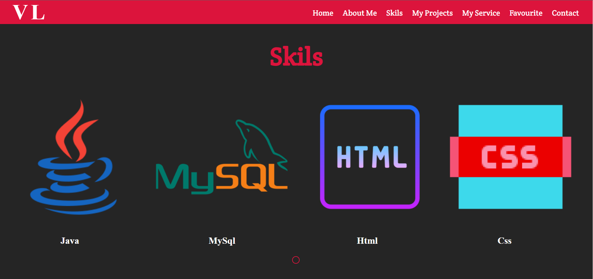

**<h1>My Profile</h1>**

**<h2>#SiteMap</h1>**

**<h2>#Wireframe </h1>**
 **Home**
 

**About**

**Skils**

**My Project**

**My Service**

**favourite**

**Contact**

**Footer**

**<h1>Overview Of My Profile</h1>**

**Home**
 

**About**

**Skils**

**My Project**

**My Service**

**favourite**

**Contact**

**Footer**

 **<h1>Links : </h1>**
- Website : 
- Mockup : [Click Here](https://www.figma.com/proto/en9tSzED4lxyoQpUZKHgMg/Untitled?node-id=14%3A8&scaling=contain&page-id=0%3A1&starting-point-node-id=14%3A8)
- Site Map : [Click Here](https://www.gloomaps.com/kcyVxYRceE)
- Wireframe : [Click Here](https://wireframe.cc/ySUVm8)
- GitHub : [Click Here](https://vidushalakshan.github.io/MyProfile1/)

